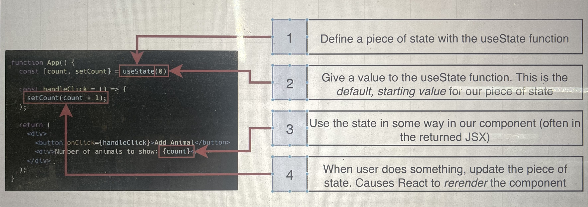
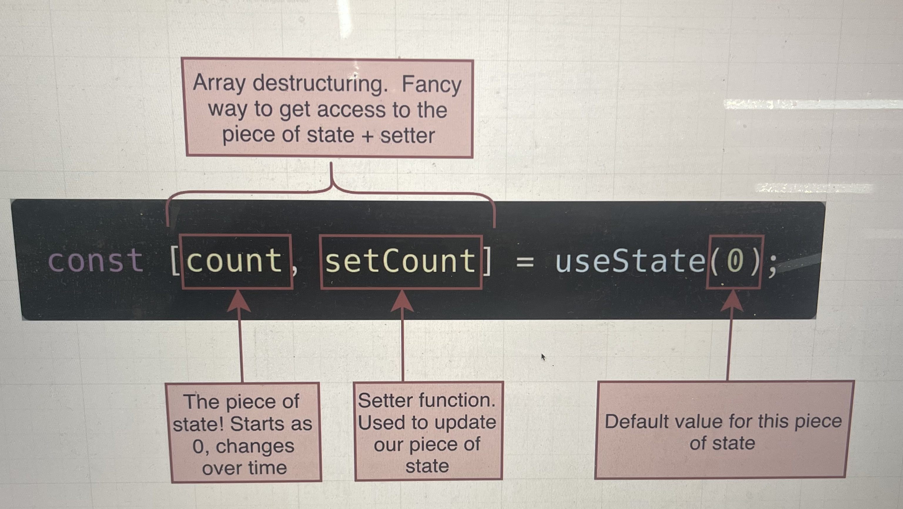

# React with Redux

This is the record for my learning journy of Udemy class "Modern React with Redux Toolkit" byStephen Grider.

# 1. Let's Dive in!

## aim: finish a traslation app

Link: https://codesandbox.io/s/react-forked-584jmr?file=/src/App.js

- what is react all about?
  (1)display html
  (2)changes that html when user does something

we tell react what content we want to show by creating fucntions that return JSX(kind of looks like html)

the functions that return JSX are refer to COMPONENTS, later we will learn how these components working together.

for example: the little app we made has five conponents(app, flower, translate, field...). JSX tells react to create a normal HTML element(with lower case) or show another component(with first letter capitalized).

- how does a react app start up?

1. All the react file will be squized into a Bundle.js and placed onto a server.
2. User makes a request to the server and get an HTML file(index.html) + the bundle.
3. User's browser executes our code.
   reference to a div with id="root"

- what are the 'useState' functions?
  ** useState is a fucntion that works with React's "state" system
  ** state is like a variable in React
  ** state is used to store data that changes over time
  ** whever state changes, React automatically updates content on the screen.
  in this app, for example, there are 3 data changed(text user typed, language user choose, result of translation)

- how did the text get translatedto another language?

Text input+ selected language ====> translate component(network request with the new text) ======> google translate app

- creat react app

  ```
  npx create-react-app <project_name>
  ```

  change into project folder

  run `npm start`

这个流程，建立一个 react app 意味着什么？files in our project(app.js, index.js... ) these are not understandable by browser. 所以我们有 dev server 去帮我们把 jsx 转换成 js，用两个工具 Babel(turn jsx to normal js) & Webpack(merge all projects files into a single file: bundle.js)

# 2. Creating Content with JSX!

- five steps of creating conponent and shows on screen (index.js)
-

```
Hi there!
```

this doesnt make anything show up in the browser. This creats an instruciton for React telling it to make an element. we have to return it from a component for React to use it.

- we can create JS variable and reder it inside JSX with {}
  (but react dont know how to render a boolean variable, it will show nothing)
  (Object are not valid JSX children, you can not render an Object in JSx, it will pop up error)

  ```
  const message = [1,2,3], return {<h1>message</h1>} // result is 123
  ```

- props is like attributes in html
  Props:
  Can refer to variable with { }

Also props don’t have to be defined as variables

```
function App() {
  Const message = “Hi”;
   Return  (
      <input
          type = “number” ————String with “”
          min = {5} ————— number with {}
          List = {[1,2,3]} ——— Arrays
          Style = {{ color:’red’}} ———— objects with {}
          Alt = {message} ——— refer to message variable with {}
```

- Converting html to jsx

1. Camal Case
2. Number has to be {}
3. Boolean, for true, it can just the Boolean variable name, for false, it must be {}
4. When we want to add the css with className style props instead of class
5. In-line styles are provided as objects

- Module systems(import/export system)
  我们想要共享很多 file 以及里面的变量，如果没有 module system，我们是不能默认做到的。所以我们需要 import 和 export 去做到，然后 module system 制定了一些规则

1. export 有两种：default&named；A file can only have one default export

2. Import process behind the scene:
   (1) Declare a variable called App
   (2) Find the default export from App.js file
   (3) Assign the default export to the variable
   attension: Default exports can be renamed in the import file, however, named exports cannot be renamed!!!

3. Named export rules:

4. Use when exporting multiple variables

   ```
   function App(){
     return <h2>hi</h2>
   }
   const messsage=‘hi’
   export { message }
   export default App
   ```

   ```
   import App, { message } from './App'
   // './'or'../' means we are importing a file that we created
   // import 'React' from 'react', without './'or'../' means we are importing a package
   ```

5. './' vs '../'

# 3. Building reusable components

1. project overview!
   building a project showing personal digital assistant
   Components hierachy: App has 3 ProfileCards
2. Steps:
   (1) creating core components: ProfileCard.js creates a component that will show single card; App.js creates a component that shows 3 copies of ProfileCard; index.js shows the App component on the screen.
   (2) making each profile looks different

- props system
  pass data from a parent ot a child. allows a parent to configure each child differently(show different content, etc). one way flow data, child cant push props back up. like 25% of understanding React.


3.images for the app
when we use the image always should shown in the project, we need to import it like a JS file, but notice we need 后缀. For other images, for example from api or website, we dont need import them.

- whenever we add image tag, we need alt prop

  4.review how css works
  bulma.io this is a css library, free styling. In professional project, we can use other's css file(library) or write costum css code. The most common way of using library is using npm install library and import that library in app.js.

# 4. State: how show content that is going to change all the time

1. app overview:
   now we want to make our app interactive. we can add animal picture when we click on add animal button and every time we click on the image, the heart of the image will get bigger.

2. introducing the event system
   two systems of react: event system(detect user behaviour) and state system(update content on screen)

3. Events in detail
   (1) What event you want?
   (2) Create a function, usually an event handler or callback function
   (3) Name the function using pattern of : handle + EventName, eg:handleClick/ handleMouseUp
   (4) Pass the funciton as a prop
   (5) Make sure you pass the function using a valid event name
   (6) Make sure you pass a reference to the function(dont call it!!!), so we can call it in the future.

4. variations on Event handler

- what's the difference between two console.log:

```
 const greeting = () => {
  return 'hi there'
 };

 console.log( greeting ); // Log the 'greeting' funciton itself. Does not call it.
 console.log( greeting() ); // Immediately call the function and log the return result.
```

- callback can be write down in one line

5. Exercise
6. Introducing the State System(update content on screen, also called rerender)
   State is for updating the content on screen. Event is catching the user behaviour.
   (see code, right now, we can update the number of animals whenever we click the button)
7. More on State
   
   
